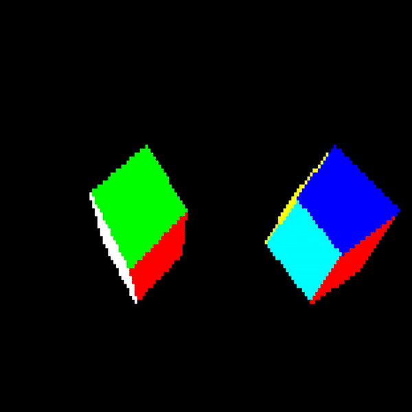

# Back Face culling with surfaces' normal
## Project Description
In this Project I created an Engine From scratch that eliminates surfaces that are not visible from the camera perspective without using any libraries, were it does everything from the bottom (Defining a 3D point in a 3D world) to screen projection (2D screen) with the essential maths that it needs

### Project Pipeline

1. Defining a 3D point
2. Defining a 3D triangle
3. Defining a mesh
4. Defining (vector, Matrix) multiplication
5. Defining Transformation Matrices (Rotation on all axis, Translation, Projection)
6. calculating surface normal after applying transformation
7. Dot product between the transformed mesh Cube (Rotated & translated ) and camera
8. Draw only the surfaces that survived the test (or the contrary)

## Results

###### Thanks to
Juvix for creating the header file olcConsoleGameEngine that handles the pixel filling between to given points
